# VBA of Wall Street

## Overview of Project

Steve, our client, is a recent graduate with a finance degree. He would like to help his parents identify a green energy stock or a basket of green energy stocks to invest in. While his parents are particular on investing in DAQO New Energy Corporation, Steve would like to diversify their funds. He requires assistance in analyzing a set of green energy stocks, and our group is the one assisting him, using Microsoft Excel and VBA to engage with the data.

### Purpose

The project is meant to inform you, the client, about the performance of green energy stocks in 2017 and 2018, based on their- 1. Total Daily Volume, and 2. Yearly Return. We will also provide you with a ready-to-analyze sheet as a template to reuse with any other stock.

---

## Analysis

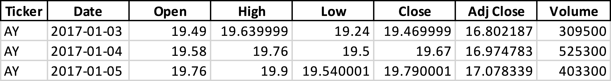

Shown above is a small snippet of our raw data set. In our analysis, we've expressed this data in terms of it's activity and return over the course of a full market year. 

 

### Stock Analysis

  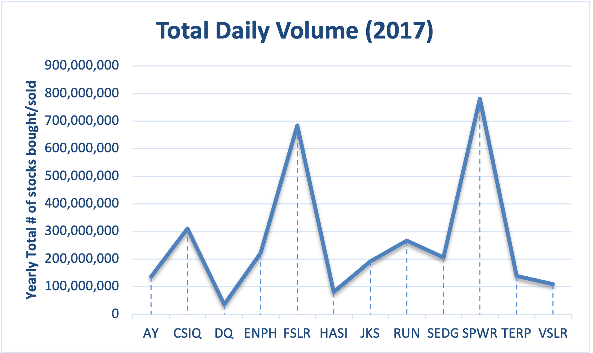
  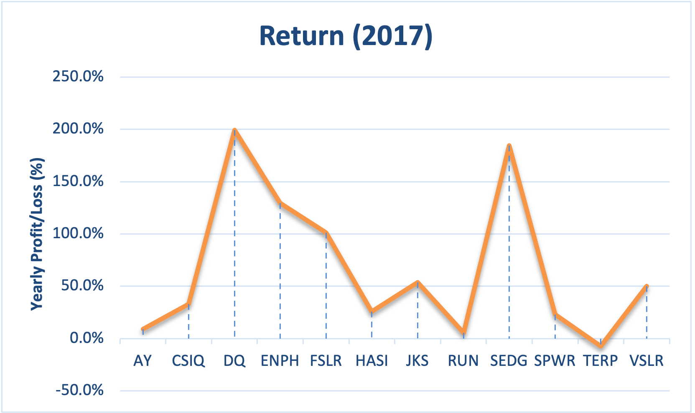 
  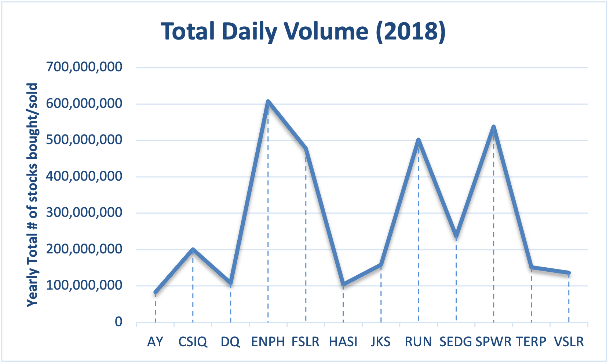
  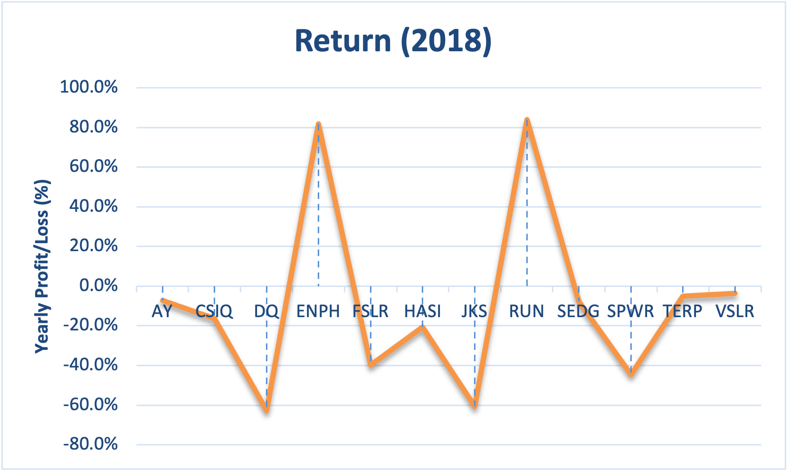 

From the above charts, we can infer that **ENPH** and **RUN** seem to be the preferrable choices of investment. Both the years, they've been in the top 5 most active green energy stocks, and they're also the only stocks, from our list, that've returned a profit in both the years. They're consistent in their performance, so your parents can invest in them without having to worry too much about when to sell and buy back, even if they're both relatively active stocks.

You should also consider investing in **SPWR**. Although it suffered quite a loss in 2018, it is one of the highly active stocks in the basket we're analyzing; this means that it has potential to rise in price soon. So, it could be a very profitable decision to invest in SPWR while it's price is so low. We recommend researching the company and it's future plans before deciding to invest in it.

We understand that your parents are looking to invest in **DQ**, but we would have to advise against that. While it was the most profitable green energy stock in 2017, it's return in 2018 was *-62.6%*. It's a relatively inactive stock, so with the scope of data we have, we can only deduce that the trend in the return is erratic. Once again, we recommend researching the company and it's future plans before deciding to invest in it.

 

### Application Discussion

Lastly, we would like to discuss the application we've created for you. While you are free to use the Developer tab in the provided ***.xlsm*** file, we've made the process of analyzing stocks more accessible.

1. Once you navigate to the 'All Stocks Analysis' sheet, you will find two buttons to use. Click 'Run Analysis For All Stocks.'

>  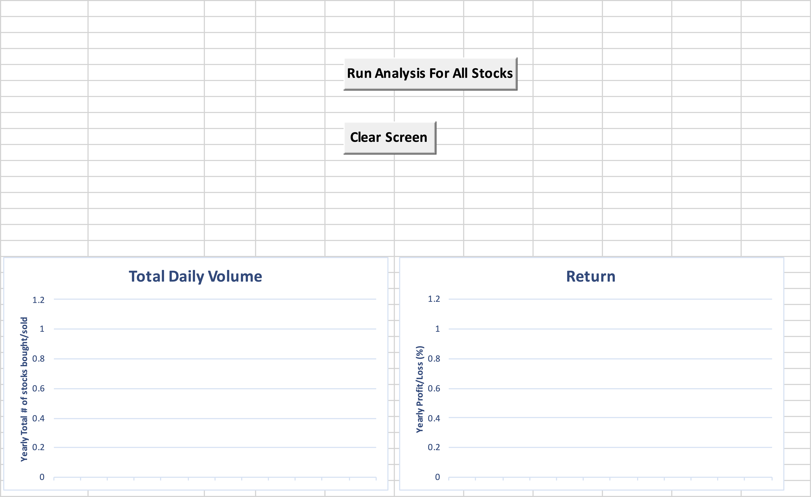

2. A pop-up will appear, asking for the year on which you like to run the analysis.

>  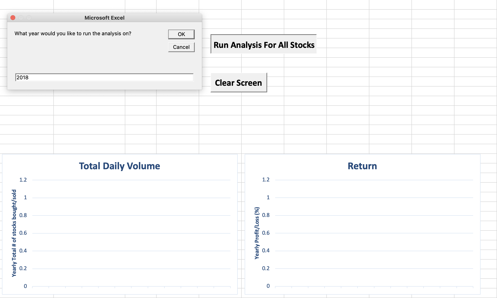

3. Finally, the cells and charts will populate, and a message box, with the time it took to run the application, will appear.

>  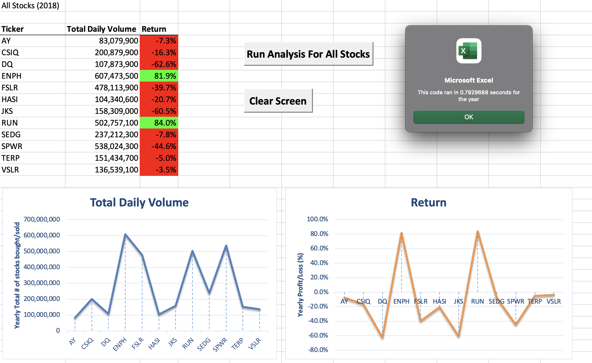

 

On completing the code for the application, we also refactored it to improve it's simplicity and efficiency. We would like to show you the results:

1. Analysis done on all stocks (2017, Left = original code, Right = refactored code):
> 

  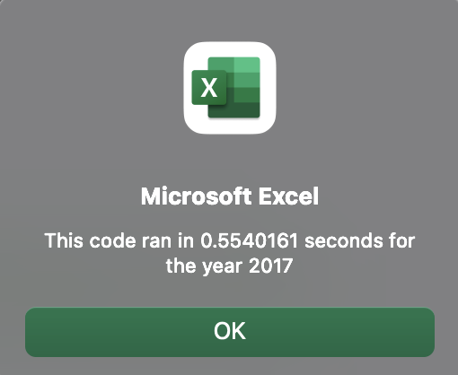
  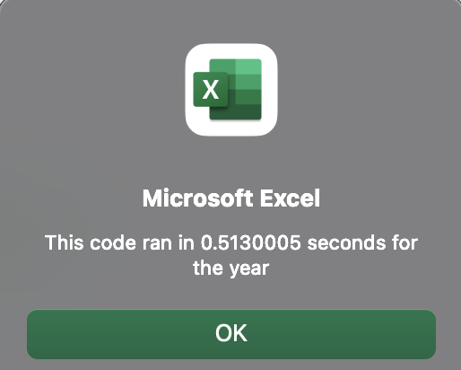 

2. Analysis done on all stocks (2017, Left = original code, Right = refactored code):
> 
 
  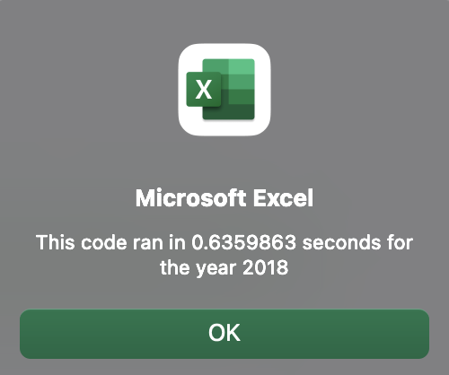
  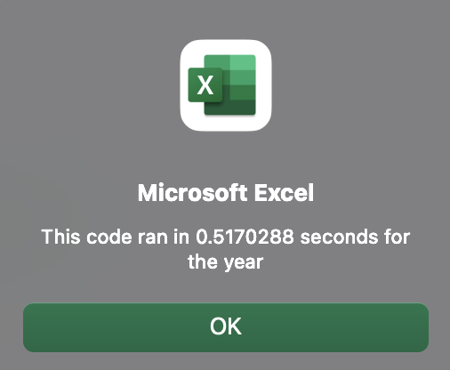 

---

## Summary

To sum it all together, the stocks your parents could safely invest in are **ENPH** and **RUN**. It is worth considering investing in **SPWR**, for a short-term, and **DQ**, for a long-term, BUT after researching the respective companies and their future outlooks. We hope the analysis and provided application is to your satisfaction.

 

### Advantages and Disadvantages of Refactoring Code

The advantages of refactoring code are many. On the side of the user, it provides a faster application while also taking up smaller space in their storage. The reasons are that refactored code is made clear of clutter and organized. An added benefit to refactoring is that it improves the experiencing of servicing the code as it is easily understandable. If you ever get a chance to go through our code, you will notice that our original code had several macros with repeating code. You will also notice that our code for formatting the data was in a seperate macro. So, we would've had to add another button to format the code had we not refactored it to be included in just one macro.

While the many noticeable advanatges of refactoring code make it seem like there could be no disadvantages, there actually is one important drawback- Time. It takes time to go through the original code and refactor it. There may be many instances where the code we're writing is more complicated and extensive than the one we've written for this analysis, and so it demands a lot of time that an agency in real life may not have. We also have to consider the value of the return-; our refactored code is merely milliseconds faster than the orignal code; while this may prove to be more valuable with a higher number of stocks to analyze, for our dataset it doesn't provide a considerable advantage.